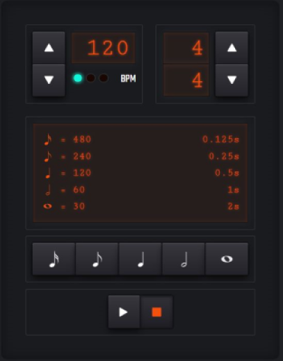

<!-- ALL-CONTRIBUTORS-BADGE:START - Do not remove or modify this section -->

<!-- ALL-CONTRIBUTORS-BADGE:END -->

# BPM Calculator

Beats Per Minute (**BPM**) is a measurement used to signify the tempo of a piece
of music. This repository contains a library and an example web application for
working with **BPM**s.

> **Demo:** Available at <https://vapurrmaid.ca/bpm>

## Contents

### lib

The `lib/` directory contains a lightweight library for working with **BPM**
calculations. For more information, please read its [README.md](lib/README.md)

### react-app

  

The `react-app/` directory contains an example web application that uses the
`lib`. The application offers a UI for calculating information about notes based
on **BPM** and _time signature_, as well as offers a real-time metronome for
playback.

#### Clicktrack.ts

Although not `export`ed, a useful reference module for building a metronome (or
clicktrack) is in the `react-app` at
[src/util/clicktrack.ts](https://github.com/vapurrmaid/bpm/blob/master/react-app/src/util/clicktrack.ts).

## Wiki

For more information regarding development and releasing, see the
[wiki](https://github.com/vapurrmaid/bpm/wiki)

## Contributors ✨

<!-- ALL-CONTRIBUTORS-LIST:START - Do not remove or modify this section -->
<!-- prettier-ignore-start -->
<!-- markdownlint-disable -->
<table>
  <tr>
    <td align="center"><a href="https://vapurrmaid.ca"> <b>G r e y</b></a> <a href="https://github.com/vapurrmaid/bpm/commits?author=vapurrmaid" title="Code">💻</a> <a href="https://github.com/vapurrmaid/bpm/commits?author=vapurrmaid" title="Documentation">📖</a> <a href="#infra-vapurrmaid" title="Infrastructure (Hosting, Build-Tools, etc)">🚇</a> <a href="#platform-vapurrmaid" title="Packaging/porting to new platform">📦</a></td>
    <td align="center"><a href="https://www.jamescarmichael.ca/"> <b>James Carmichael</b></a> <a href="https://github.com/vapurrmaid/bpm/commits?author=updownupdown" title="Code">💻</a> <a href="#design-updownupdown" title="Design">🎨</a></td>
  </tr>
</table>

<!-- markdownlint-enable -->
<!-- prettier-ignore-end -->

<!-- ALL-CONTRIBUTORS-LIST:END -->
